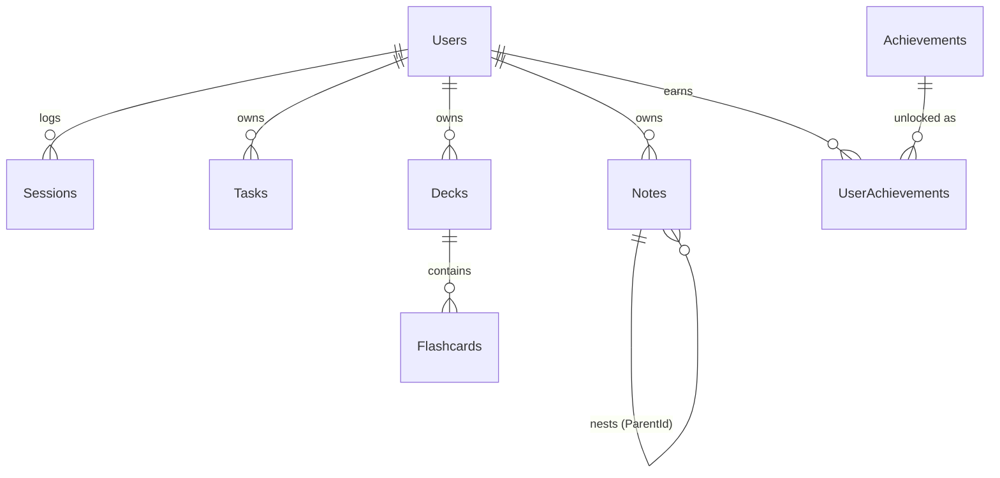

# 📚 Study Hub

A full-stack study platform with a Pomodoro timer, session logs, flashcards (spaced repetition), a Kanban board, notes, analytics, streaks, gamification, and ambient soundscapes.

- **Backend:** ASP.NET Core 8 Web API (C#)
- **Frontend:** Next.js 14 (App Router, TypeScript, Tailwind, Framer Motion)
- **Database:** PostgreSQL (Entity Framework Core)

---

## 🚀 Quick start (Docker — recommended)

You only need [Docker Desktop](https://www.docker.com/products/docker-desktop/) installed.

```bash
docker compose up --build
```

Then open:

- Frontend → http://localhost:3000
- API + Swagger → http://localhost:5080/swagger

The database is created and migrated automatically on first run. Create an account on the
register page and start studying.

To stop: `Ctrl+C`, then `docker compose down` (add `-v` to also wipe the database volume).

---

## 🧑‍💻 Local development (without Docker)

### 1. PostgreSQL
Have a Postgres 15+ instance running. Default connection used by the API:

```
Host=localhost;Port=5432;Database=studyhub;Username=studyhub;Password=studyhub
```

Override via the `ConnectionStrings__Default` environment variable or `appsettings.Development.json`.

### 2. Backend
```bash
cd backend/StudyHub.Api
dotnet restore
dotnet run
```
API runs on http://localhost:5080. Migrations are applied automatically at startup.

### 3. Frontend
```bash
cd frontend
cp .env.local.example .env.local   # points NEXT_PUBLIC_API_URL at the API
npm install
npm run dev
```
Frontend runs on http://localhost:3000.

---

## ✨ Features

| Area | Feature | Status |
|------|---------|--------|
| Focus | Pomodoro timer (configurable work/break) | ✅ |
| Focus | Session logging + time analytics per subject | ✅ |
| Focus | Ambient soundscapes (rain, lo-fi, white noise, café) | ✅ |
| Productivity | Kanban task board (To do / Doing / Done) | ✅ |
| Learning | Flashcard decks with SM-2 spaced repetition | ✅ |
| Learning | Hierarchical notes | ✅ |
| Motivation | Study streaks | ✅ |
| Motivation | Achievement badges + XP | ✅ |
| Tracking | Dashboard analytics (focus hours, heatmap) | ✅ |
| AI | Quiz generator / Socratic tutor | 🔜 scaffolded |
| Collab | Live study rooms (WebRTC) | 🔜 scaffolded |

See `ROADMAP.md` for how the scaffolded features are wired.

---

## 🏗️ Project structure

```
study/
├── docker-compose.yml
├── backend/
│   └── StudyHub.Api/        # ASP.NET Core 8 Web API
│       ├── Controllers/
│       ├── Models/
│       ├── Data/
│       ├── Services/
│       └── DTOs/
└── frontend/                # Next.js 14 app
    ├── app/
    ├── components/
    └── lib/
```

---

## 🗄️ Database schema

PostgreSQL via EF Core. The schema is created automatically on first boot
(`Database.EnsureCreated()` in `Program.cs`); the `Achievements` catalog is seeded with 8 rows.
Table names match the `DbSet` names (`Users`, `Sessions`, `Tasks`, `Decks`, `Flashcards`,
`Notes`, `Achievements`, `UserAchievements`).



### `Users`
| Column | Type | Notes |
|--------|------|-------|
| Id | uuid | **PK** |
| DisplayName | varchar(80) | |
| Email | varchar(160) | **unique** |
| PasswordHash | text | BCrypt hash |
| Xp | int | total experience points |
| CurrentStreak | int | consecutive study days |
| LongestStreak | int | |
| LastStudyDate | date? | last day a session was logged |
| PomodoroWorkMinutes | int | default `25` |
| PomodoroShortBreakMinutes | int | default `5` |
| PomodoroLongBreakMinutes | int | default `15` |
| PomodoroRoundsBeforeLongBreak | int | default `4` |
| CreatedAt | timestamptz | |

### `Sessions` (logged focus blocks)
| Column | Type | Notes |
|--------|------|-------|
| Id | uuid | **PK** |
| UserId | uuid | **FK → Users** (cascade) |
| Subject | varchar(120) | default `"General"` |
| DurationMinutes | int | focused minutes |
| Notes | varchar(500)? | |
| StartedAt / EndedAt | timestamptz | |

### `Tasks` (Kanban)
| Column | Type | Notes |
|--------|------|-------|
| Id | uuid | **PK** |
| UserId | uuid | **FK → Users** (cascade) |
| Title | varchar(200) | |
| Description | varchar(1000)? | |
| Status | int | `0` Todo · `1` Doing · `2` Done |
| Position | int | order within a column |
| DueDate | date? | |
| Subject | varchar(60)? | |
| CreatedAt / UpdatedAt | timestamptz | |

### `Decks`
| Column | Type | Notes |
|--------|------|-------|
| Id | uuid | **PK** |
| UserId | uuid | **FK → Users** (cascade) |
| Name | varchar(120) | |
| Description | varchar(400)? | |
| Color | varchar(20) | hex, default `#7c5cff` |
| CreatedAt | timestamptz | |

### `Flashcards` (SM-2 spaced repetition)
| Column | Type | Notes |
|--------|------|-------|
| Id | uuid | **PK** |
| DeckId | uuid | **FK → Decks** (cascade) |
| Front / Back | varchar(2000) | |
| EaseFactor | double | SM-2 ease, default `2.5` (floor `1.3`) |
| IntervalDays | int | current interval, default `0` |
| Repetitions | int | consecutive correct reviews |
| DueAt | timestamptz | next review time |
| LastReviewedAt | timestamptz? | |
| CreatedAt | timestamptz | |

### `Notes` (hierarchical)
| Column | Type | Notes |
|--------|------|-------|
| Id | uuid | **PK** |
| UserId | uuid | **FK → Users** (cascade) |
| ParentId | uuid? | **FK → Notes** (self, restrict); null = top level |
| Title | varchar(200) | |
| Content | text | |
| Icon | varchar(20) | emoji, default `📝` |
| CreatedAt / UpdatedAt | timestamptz | |

### `Achievements` (seeded catalog)
| Column | Type | Notes |
|--------|------|-------|
| Code | varchar(60) | **PK** (e.g. `streak_7`) |
| Title | varchar(120) | |
| Description | varchar(300) | |
| Icon | varchar(20) | |
| XpReward | int | default `50` |

### `UserAchievements`
| Column | Type | Notes |
|--------|------|-------|
| Id | uuid | **PK** |
| UserId | uuid | **FK → Users** (cascade) |
| AchievementCode | varchar(60) | **FK → Achievements** (cascade) |
| UnlockedAt | timestamptz | |
| | | **unique** (UserId, AchievementCode) |

---

## 🔌 API reference

Base URL: `http://localhost:5080` (local) · interactive docs at **`/swagger`**.

**Auth:** all endpoints under `/api/*` require a JWT **except** `register` and `login`.
Send it as a header: `Authorization: Bearer <token>`. Tokens are returned by register/login
and expire after 30 days. All request/response bodies are JSON.

### Public
| Method | Path | Description |
|--------|------|-------------|
| `GET` | `/` | Service info |
| `GET` | `/health` | Health check → `{ "status": "healthy" }` |

### Auth — `/api/auth`
| Method | Path | Body | Description |
|--------|------|------|-------------|
| `POST` | `/register` | `{ displayName, email, password }` | Create account → `{ token, user }` |
| `POST` | `/login` | `{ email, password }` | Sign in → `{ token, user }` |
| `GET` | `/me` | — | 🔒 Current user |
| `PUT` | `/preferences` | `{ pomodoroWorkMinutes, pomodoroShortBreakMinutes, pomodoroLongBreakMinutes, pomodoroRoundsBeforeLongBreak }` | 🔒 Update Pomodoro defaults → `user` |

### Sessions — `/api/sessions` 🔒
| Method | Path | Body / Query | Description |
|--------|------|------|-------------|
| `GET` | `/` | `?take=50` | Recent sessions (newest first) |
| `POST` | `/` | `{ subject, durationMinutes, notes?, startedAt?, endedAt? }` | Log a session → `{ session, unlocked[], user }` (also updates streak/XP + unlocks badges) |
| `DELETE` | `/{id}` | — | Delete a session |

### Tasks — `/api/tasks` 🔒
| Method | Path | Body | Description |
|--------|------|------|-------------|
| `GET` | `/` | — | All tasks (ordered by status, then position) |
| `POST` | `/` | `{ title, description?, subject?, dueDate? }` | Create task |
| `PUT` | `/{id}` | `{ title?, description?, subject?, dueDate?, status?, position? }` | Update / move task |
| `DELETE` | `/{id}` | — | Delete task |

### Decks & Flashcards — `/api/decks` 🔒
| Method | Path | Body | Description |
|--------|------|------|-------------|
| `GET` | `/` | — | Decks with `cardCount` + `dueCount` |
| `POST` | `/` | `{ name, description?, color? }` | Create deck |
| `DELETE` | `/{id}` | — | Delete deck (cascades cards) |
| `GET` | `/{deckId}/cards` | — | All cards in a deck |
| `GET` | `/{deckId}/due` | — | Cards due for review now (study queue) |
| `POST` | `/{deckId}/cards` | `{ front, back }` | Add a card |
| `DELETE` | `/cards/{cardId}` | — | Delete a card |
| `POST` | `/cards/{cardId}/review` | `{ quality }` | Grade a review with SM-2. `quality` 0–5 (`<3` resets the card) → updated card |

### Notes — `/api/notes` 🔒
| Method | Path | Body | Description |
|--------|------|------|-------------|
| `GET` | `/` | — | All notes |
| `GET` | `/{id}` | — | One note |
| `POST` | `/` | `{ title?, parentId?, icon? }` | Create note |
| `PUT` | `/{id}` | `{ title?, content?, icon?, parentId? }` | Update note |
| `DELETE` | `/{id}` | — | Delete note (children re-parent to its parent) |

### Dashboard — `/api/dashboard` 🔒
| Method | Path | Description |
|--------|------|-------------|
| `GET` | `/` | Stats: total/today minutes, session count, due cards, open tasks, time-by-subject, 90-day heatmap |
| `GET` | `/achievements` | Full badge catalog with `unlocked` + `unlockedAt` per badge |

<details>
<summary>Example: register response</summary>

```json
{
  "token": "eyJhbGciOiJIUzI1NiIsInR5cCI6IkpXVCJ9...",
  "user": {
    "id": "0b3f...e1", "displayName": "Ana", "email": "ana@example.com",
    "xp": 0, "currentStreak": 0, "longestStreak": 0,
    "pomodoroWorkMinutes": 25, "pomodoroShortBreakMinutes": 5,
    "pomodoroLongBreakMinutes": 15, "pomodoroRoundsBeforeLongBreak": 4
  }
}
```
</details>

---

## 🔐 Environment variables

| Variable | Where | Default | Notes |
|----------|-------|---------|-------|
| `ConnectionStrings__Default` | API | local postgres | Accepts Npgsql `Host=...;` **or** a `postgres://` URL (Render/Supabase) |
| `Jwt__Key` | API | dev key | **Change in prod** — 32+ random chars |
| `Jwt__Issuer` / `Jwt__Audience` | API | `StudyHub` / `StudyHubClient` | |
| `Cors__AllowedOrigins__0` (`__1`, …) | API | _(empty)_ | Allowed frontend origins; empty = allow any (safe: Bearer-token auth, no cookies) |
| `CORS_ORIGINS` | API | _(empty)_ | Alternative: comma-separated origins |
| `NEXT_PUBLIC_API_URL` | Frontend | `http://localhost:5080` | API base URL (baked in at build time) |
| `NEXT_OUTPUT` | Frontend build | _(unset)_ | `standalone` (Docker) or `export` (static hosting) |

**In production, set a strong `Jwt__Key` (32+ chars) and real DB credentials.**
See [DEPLOY.md](DEPLOY.md) for hosting (Render / Supabase / Vercel / Netlify).
