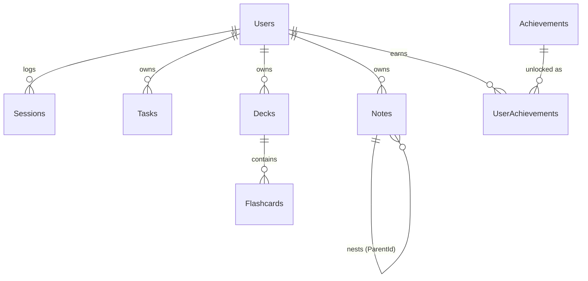

<div align="center">


# Study Hub

**Your focus timer, flashcards, tasks & notes — all in one calm study space.**

<p>
  
  
  
  
  
  
</p>

</div>

---

## ✨ Features

|  |  |
|--|--|
| ⏱️ **Pomodoro timer** — configurable work/break, runs accurately even in background tabs | 📊 **Analytics** — focus hours, per-subject breakdown, 90-day heatmap |
| 🃏 **Flashcards** — decks with SM-2 spaced repetition | 🗂️ **Kanban board** — To do / Doing / Done task flow |
| 📝 **Notes** — nestable, hierarchical notebooks | 🔥 **Streaks** — daily study streak tracking |
| 🏆 **Gamification** — XP + 20 achievement badges | 🔐 **Auth** — JWT accounts, BCrypt-hashed passwords |

> 🔜 **Planned:** AI quiz generator / Socratic tutor · live study rooms — see [ROADMAP.md](ROADMAP.md).

---

## 🚀 Quick start

All you need is [Docker Desktop](https://www.docker.com/products/docker-desktop/):

```bash
docker compose up --build
```

| Service | URL |
|---------|-----|
| 🖥️ Frontend | http://localhost:3000 |
| 🔌 API + Swagger | http://localhost:5080/swagger |

The database is created and migrated automatically. Register an account and start studying.
Stop with `Ctrl+C`, then `docker compose down` (add `-v` to wipe the DB volume).

<details>
<summary><b>🧑‍💻 Run locally without Docker</b></summary>

<br>

**1. PostgreSQL 15+** — default connection used by the API:

```
Host=localhost;Port=5432;Database=studyhub;Username=studyhub;Password=studyhub
```

Override via `ConnectionStrings__Default` or `appsettings.Development.json`.

**2. Backend** → http://localhost:5080 (migrations apply on startup):

```bash
cd backend/StudyHub.Api
dotnet restore
dotnet run
```

**3. Frontend** → http://localhost:3000:

```bash
cd frontend
cp .env.local.example .env.local   # points NEXT_PUBLIC_API_URL at the API
npm install
npm run dev
```

</details>

---

## 🏗️ Tech stack

**ASP.NET Core 8** Web API · **Next.js 14** (App Router, TypeScript, Tailwind, Framer Motion) · **PostgreSQL** via EF Core.

```
StudyHub/
├── docker-compose.yml
├── backend/StudyHub.Api/   # ASP.NET Core 8 — Controllers, Models, Data, Services, DTOs
└── frontend/               # Next.js 14 — app/, components/, lib/
```

---

## 📖 Reference

<details>
<summary><b>🗄️ Database schema</b></summary>

<br>

PostgreSQL via EF Core. The schema is created automatically on first boot
(`Database.EnsureCreated()` in `Program.cs`); the `Achievements` catalog is seeded with 20 rows
(and topped up at startup when new badges are added — see `SeedAchievementsAsync`).
Table names match the `DbSet` names.



### `Users`
| Column | Type | Notes |
|--------|------|-------|
| Id | uuid | **PK** |
| DisplayName | varchar(80) | |
| Email | varchar(160) | **unique** |
| PasswordHash | text | BCrypt hash |
| Xp | int | total experience points |
| CurrentStreak | int | consecutive study days |
| LongestStreak | int | |
| LastStudyDate | date? | last day a session was logged |
| PomodoroWorkMinutes | int | default `25` |
| PomodoroShortBreakMinutes | int | default `5` |
| PomodoroLongBreakMinutes | int | default `15` |
| PomodoroRoundsBeforeLongBreak | int | default `4` |
| CreatedAt | timestamptz | |

### `Sessions` (logged focus blocks)
| Column | Type | Notes |
|--------|------|-------|
| Id | uuid | **PK** |
| UserId | uuid | **FK → Users** (cascade) |
| Subject | varchar(120) | default `"General"` |
| DurationMinutes | int | focused minutes |
| Notes | varchar(500)? | |
| StartedAt / EndedAt | timestamptz | |

### `Tasks` (Kanban)
| Column | Type | Notes |
|--------|------|-------|
| Id | uuid | **PK** |
| UserId | uuid | **FK → Users** (cascade) |
| Title | varchar(200) | |
| Description | varchar(1000)? | |
| Status | int | `0` Todo · `1` Doing · `2` Done |
| Position | int | order within a column |
| DueDate | date? | |
| Subject | varchar(60)? | |
| CreatedAt / UpdatedAt | timestamptz | |

### `Decks`
| Column | Type | Notes |
|--------|------|-------|
| Id | uuid | **PK** |
| UserId | uuid | **FK → Users** (cascade) |
| Name | varchar(120) | |
| Description | varchar(400)? | |
| Color | varchar(20) | hex, default `#7c5cff` |
| CreatedAt | timestamptz | |

### `Flashcards` (SM-2 spaced repetition)
| Column | Type | Notes |
|--------|------|-------|
| Id | uuid | **PK** |
| DeckId | uuid | **FK → Decks** (cascade) |
| Front / Back | varchar(2000) | |
| EaseFactor | double | SM-2 ease, default `2.5` (floor `1.3`) |
| IntervalDays | int | current interval, default `0` |
| Repetitions | int | consecutive correct reviews |
| DueAt | timestamptz | next review time |
| LastReviewedAt | timestamptz? | |
| CreatedAt | timestamptz | |

### `Notes` (hierarchical)
| Column | Type | Notes |
|--------|------|-------|
| Id | uuid | **PK** |
| UserId | uuid | **FK → Users** (cascade) |
| ParentId | uuid? | **FK → Notes** (self, restrict); null = top level |
| Title | varchar(200) | |
| Content | text | |
| Icon | varchar(20) | emoji, default `📝` |
| CreatedAt / UpdatedAt | timestamptz | |

### `Achievements` (seeded catalog)
| Column | Type | Notes |
|--------|------|-------|
| Code | varchar(60) | **PK** (e.g. `streak_7`) |
| Title | varchar(120) | |
| Description | varchar(300) | |
| Icon | varchar(20) | |
| XpReward | int | default `50` |

### `UserAchievements`
| Column | Type | Notes |
|--------|------|-------|
| Id | uuid | **PK** |
| UserId | uuid | **FK → Users** (cascade) |
| AchievementCode | varchar(60) | **FK → Achievements** (cascade) |
| UnlockedAt | timestamptz | |
| | | **unique** (UserId, AchievementCode) |

</details>

<details>
<summary><b>🔌 API reference</b></summary>

<br>

Base URL: `http://localhost:5080` (local) · interactive docs at **`/swagger`**.

**Auth:** all `/api/*` endpoints require a JWT **except** `register` and `login`.
Send it as `Authorization: Bearer <token>`. Tokens come from register/login and expire after 30 days.
All bodies are JSON. 🔒 = auth required.

### Public
| Method | Path | Description |
|--------|------|-------------|
| `GET` | `/` | Service info |
| `GET` | `/health` | Health check → `{ "status": "healthy" }` |

### Auth — `/api/auth`
| Method | Path | Body | Description |
|--------|------|------|-------------|
| `POST` | `/register` | `{ displayName, email, password }` | Create account → `{ token, user }` |
| `POST` | `/login` | `{ email, password }` | Sign in → `{ token, user }` |
| `GET` | `/me` | — | 🔒 Current user |
| `PUT` | `/preferences` | `{ pomodoroWorkMinutes, pomodoroShortBreakMinutes, pomodoroLongBreakMinutes, pomodoroRoundsBeforeLongBreak }` | 🔒 Update Pomodoro defaults → `user` |

### Sessions — `/api/sessions` 🔒
| Method | Path | Body / Query | Description |
|--------|------|------|-------------|
| `GET` | `/` | `?take=50` | Recent sessions (newest first) |
| `POST` | `/` | `{ subject, durationMinutes, notes?, startedAt?, endedAt? }` | Log a session → `{ session, unlocked[], user }` (also updates streak/XP + unlocks badges) |
| `DELETE` | `/{id}` | — | Delete a session |

### Tasks — `/api/tasks` 🔒
| Method | Path | Body | Description |
|--------|------|------|-------------|
| `GET` | `/` | — | All tasks (ordered by status, then position) |
| `POST` | `/` | `{ title, description?, subject?, dueDate? }` | Create task |
| `PUT` | `/{id}` | `{ title?, description?, subject?, dueDate?, status?, position? }` | Update / move task |
| `DELETE` | `/{id}` | — | Delete task |

### Decks & Flashcards — `/api/decks` 🔒
| Method | Path | Body | Description |
|--------|------|------|-------------|
| `GET` | `/` | — | Decks with `cardCount` + `dueCount` |
| `POST` | `/` | `{ name, description?, color? }` | Create deck |
| `DELETE` | `/{id}` | — | Delete deck (cascades cards) |
| `GET` | `/{deckId}/cards` | — | All cards in a deck |
| `GET` | `/{deckId}/due` | — | Cards due for review now (study queue) |
| `POST` | `/{deckId}/cards` | `{ front, back }` | Add a card |
| `DELETE` | `/cards/{cardId}` | — | Delete a card |
| `POST` | `/cards/{cardId}/review` | `{ quality }` | Grade a review with SM-2. `quality` 0–5 (`<3` resets the card) → updated card |

### Notes — `/api/notes` 🔒
| Method | Path | Body | Description |
|--------|------|------|-------------|
| `GET` | `/` | — | All notes |
| `GET` | `/{id}` | — | One note |
| `POST` | `/` | `{ title?, parentId?, icon? }` | Create note |
| `PUT` | `/{id}` | `{ title?, content?, icon?, parentId? }` | Update note |
| `DELETE` | `/{id}` | — | Delete note (children re-parent to its parent) |

### Dashboard — `/api/dashboard` 🔒
| Method | Path | Description |
|--------|------|-------------|
| `GET` | `/` | Stats: total/today minutes, session count, due cards, open tasks, time-by-subject, 90-day heatmap |
| `GET` | `/achievements` | Full badge catalog with `unlocked` + `unlockedAt` per badge |

</details>

<details>
<summary><b>🔐 Environment variables</b></summary>

<br>

| Variable | Where | Default | Notes |
|----------|-------|---------|-------|
| `ConnectionStrings__Default` | API | local postgres | Accepts Npgsql `Host=...;` **or** a `postgres://` URL (Render/Supabase) |
| `Jwt__Key` | API | dev key | **Change in prod** — 32+ random chars |
| `Jwt__Issuer` / `Jwt__Audience` | API | `StudyHub` / `StudyHubClient` | |
| `Cors__AllowedOrigins__0` (`__1`, …) | API | _(empty)_ | Allowed frontend origins; empty = allow any (safe: Bearer-token auth, no cookies) |
| `CORS_ORIGINS` | API | _(empty)_ | Alternative: comma-separated origins |
| `NEXT_PUBLIC_API_URL` | Frontend | `http://localhost:5080` | API base URL (baked in at build time) |
| `NEXT_OUTPUT` | Frontend build | _(unset)_ | `standalone` (Docker) or `export` (static hosting) |

**In production, set a strong `Jwt__Key` (32+ chars) and real DB credentials.**

</details>

---

## 🚀 Deployment

One-click deploy on **Render** (Blueprint in [`render.yaml`](render.yaml)); the frontend can also be
hosted statically on Vercel / Netlify / GitHub Pages. Full guide → **[DEPLOY.md](DEPLOY.md)**.

## 📄 License

[MIT](LICENSE) © Osamah Ananzeh
